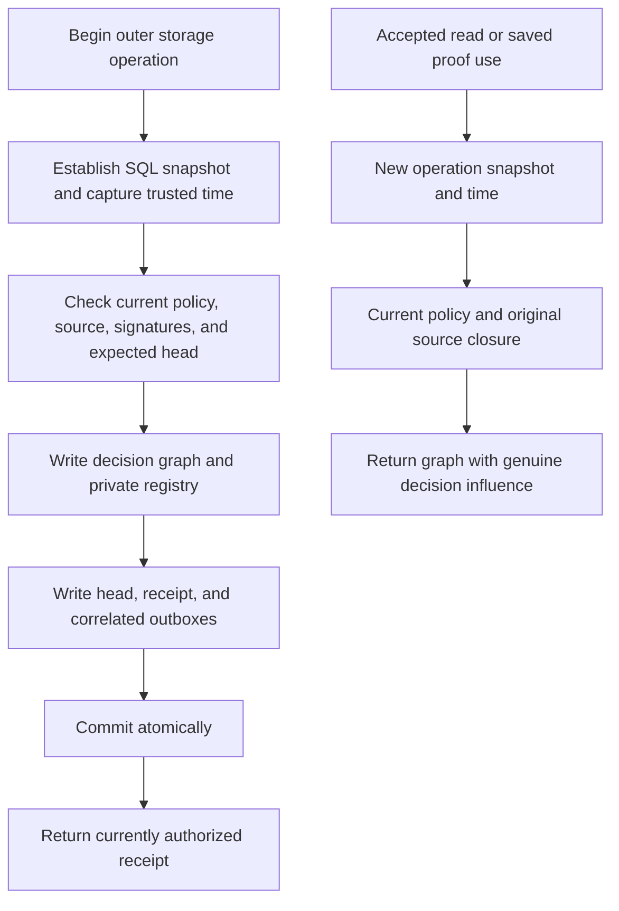

# Accepted governance graphs and trusted operation time

**Status: reviewed design; native implementation and evidence are described in [GOVERNANCE_GRAPHS.md](GOVERNANCE_GRAPHS.md).** This document is based on engine `c51393b`. The native [governance API](GOVERNANCE.md) already records signed approvals, decisions, receipts, and authorized delivery. Protocol [0.15](contract/v0.15/README.md) supplies generic assertion/node influence. Neither fact makes a SQL governance decision a graph assertion. The metadata selector compatibility blocker in the 0.15 candidate must be resolved independently before its publication.

This proposal adds genuine immutable decision graphs and a native accepted-view query. Every use remains subject to current policy and current source authorization, evaluated at one engine-owned operation time. It does not install remote policy roots, add a language operator, or complete federation, selective disclosure, or the broader governance roadmap.

## 1. Trusted operation time

Introduce a host-only `TrustedClock` abstraction installed when constructing the engine. `Engine::open` and `Engine::memory` retain their signatures and use the system clock. New options-based constructors accept an embedding-host clock; it is not deserializable and cannot be supplied by a program, graph property, capsule, adapter payload, or signed request body. A manual clock supports deterministic tests. Clock installation is part of the trusted embedding boundary, just as installation of a policy root is today.

The clock returns checked Unix milliseconds. Negative values, overflow, failure, or a backward step relative to the previous sample on that engine instance fail with `E_CLOCK_UNAVAILABLE`. Do not silently clamp backward samples or fall back to source timestamps. System-clock use assumes the host maintains correct UTC; this profile does **not** resist a trusted administrator rolling back the OS clock or restoring an older database across engine restarts. A durable monotonic authority floor or external time attestation is a separate design with read-write and recovery costs, not an implied property of this interface.

A private operation scope owns the captured timestamp, shared read budget, and authorization recursion budget. It must obey these rules:

1. Establish the outer SQLite transaction/snapshot, then sample the clock once, before the first authority decision. A deferred read transaction must actually establish its snapshot before sampling. A mutation acquires its transaction before sampling.
2. Nested query, join, proof resolution, metadata traversal, capsule inspection, view refresh, receipt validation, and dispatch checks reuse that scope. They cannot independently sample a later time or choose an earlier one.
3. The scope cannot escape a public call. No public reusable operation token is issued. A top-level retry after a busy/conflict error creates a new scope and timestamp; an internal proof traversal cannot refresh time selectively.
4. Transaction cleanup and scope cleanup occur on every error and panic-unwind path. Preserve the current `Engine: Send` property without making a connection concurrently usable.

Policy authority is evaluated at the captured snapshot/time boundary. A policy that expires while a bounded operation is computing may finish that operation; its next operation is denied. This is not instantaneous recall of previously returned bytes. Revocation committed after the operation's established SQL snapshot takes effect on the next operation. Tests must state this linearization rule rather than asserting impossible cross-transaction simultaneity.

`QueryPlan.valid_at`, assertion valid intervals, source receipt time, live-view tick time, approval `issued_at_ms`, and historical decision `accepted_at_ms` remain data. None can change the current authorization time. The claimed time inside a signed approval is checked against the trusted captured time, not trusted merely because it is signed.

### Existing native API compatibility

Make an explicit breaking native API migration to clock-driven entry points for governance proposal, approval, acceptance, inspection, and governance delivery. Remove or rename authority-time parameters at compile time; do not retain a `now` argument and silently ignore it. Update embedding callers, CLI fixtures, and tests intentionally. Tests that previously passed a simulated timestamp must install a manual clock. This experimental crate can make that break without retaining a second backdatable path that creates graph-exposed decisions. Scheduling/data timestamps remain distinctly named and retain only their documented non-authority meaning.

Audit all other explicit-time authority APIs in the same implementation stage: signed admission expiry and retry, mount proof revalidation, adapter lease validity, and cached receipt validation. They must use the captured time for current authority and lease fencing. A separate scheduler/tick argument may remain only for data scheduling semantics, never policy/grant validity. Add new names where separating these meanings prevents ambiguity. Changing the trusted time boundary must be documented as a native API behavioral migration, even without a graph protocol change.

## 2. Genuine immutable decision records

Create one immutable graph per new decision in a reserved namespace, provisionally `weave:governance:decision:<opaque occurrence id>`. The exact spelling is an implementation review item, not a reserved public wire contract. Continue using random durable decision occurrence IDs; never hash private policy membership or approval counts into an observable identifier.

Use the explicit structural/assertion profile and a fixed kernel-owned schema. A minimal record contains:

- A decision node with the view ID, opaque decision occurrence, action kind, and trusted acceptance timestamp.
- A structural self-relation and a positive assertion, with stable local assertion ID `accepted`, expressing that this decision was admitted.
- For publication, an exact source `GraphRef`; represent any traversable source link as a genuine pinned graph attachment. A policy transition can record its effective source pin without asserting fresh approval of different source content.

The assertion's interval describes the historical admission event (for example, from acceptance onward); it is **not** a grant whose current validity can be inferred from that interval. The fixed source label describes kernel attribution. Neither the label nor the predicate authenticates a raw record.

Exclude voter identities/counts, quorum size, approval signatures, proposal digests, hidden policy roster commitments, and predecessor-chain counts from ordinary graph properties. Keep detailed signed evidence in bounded native inspection APIs under their separate collector/admin boundary. Initial graph exposure need not reveal admitted policy labels either: the private decision registry provides that binding for authorization. Reading a minimal record does not grant access to the approval roster.

A private registry binds the exact decision graph/revision to its SQL decision, view, action, admitted policy, effective source/branch, record digest, and trusted-clock profile. Resolution requires both a valid immutable record and this exact registry entry. Correctly spelled graph IDs or copied JSON are insufficient. Missing or inconsistent bindings fail closed.

All new decisions, including policy transitions, may receive records. A current accepted read after a transition depends on both the latest decision record and the publication decision that actually admitted the effective source. The private registry may store that publication pointer directly; it must not expose the intervening policy chain or synthesize new content approval. A later implementation may optimize duplicate dependency refs without removing either semantic obligation.

### Legacy decisions

Do not silently backfill graph authority from existing SQL-only decisions. Their historical trusted-host timestamp convention is different, and older persisted occurrence IDs may predate opaque IDs. Preserve existing receipts and inspection behavior; do not rewrite signatures, IDs, source hashes, or timestamps. Reusable accepted graph exposure requires a fresh publication admitted through the new clock-driven path. A policy transition that still points to an unexposed legacy publication remains unavailable through the new accepted graph query until such a publication exists.

## 3. Current policy guard

Introduce one common protected-reference guard that composes the existing accepted-identity guard with governance guards. Replacing scattered identity-only checks is safer than asking every new caller to remember a second unrelated condition. Ordinary graphs retain ordinary authorization behavior.

For a registered decision reference, the guard must establish, in the same operation scope:

1. The decision registry/content binding is valid.
2. The view's **current** policy is active at the captured time and authorizes this reader. A historical policy reference supplied by the caller cannot choose current authority.
3. The decision's original effective source pin is currently permitted and reachable in a currently allowed accepted branch/history. Creation-branch labels alone are insufficient.
4. That exact source and its transitive assertion, node, typed-context, and whole-value influences remain authorized. Use the first-profile whole-source check; no implicit declassification or selective publication.

Missing, expired, revoked, hidden, cyclic, or unavailable dependencies use generic denial. Share visited keys and depth/work/read budgets across governance and graph recursion; recursive decision/source dependencies cannot restart their own budgets. A source referring back to the decision under construction cannot pass admission. No private roster/count/reference is returned in errors or partial envelopes.

Historical signatures show how admission occurred. A historical read does not require an old vote to remain unexpired forever, but it always requires the current policy/source checks above. Mutation receipt retries retain their stricter current proposal/quorum/epoch semantics from the native API; do not promise unconditional lost-response replay after authority expires or a policy transition changes the epoch.

## 4. Native accepted-view reads

Initially expose only a native host method, conceptually `query_accepted_view(selection, query_options, host)`. Selection is either the current head of a named view or a specific historical decision occurrence. It cannot install a policy, choose a current authority time, override the source revision, or relabel a historical decision as current. Any future language DTO requires a separate versioned review.

Resolve the selection once inside the operation snapshot. Query the exact effective source pin with requested fact filters and budgets. The output carries a `GraphData.influence` assertion gate to the genuine decision record, plus the original publication record when the current decision is a policy transition. Merge every original source influence, even when the source or filtered output is empty. Include actual record pins in the provenance/snapshot envelope. A missing or unauthorized required decision yields a generic unavailable error; it is not a complete empty accepted result.

The native response may include a separate receipt saying which selection was observed at which captured time. A persisted graph is historical evidence of that selection, not a durable assertion that it remains the latest head. Selecting an old decision returns its own source; it never silently follows today's accepted source. A head change therefore does not falsify immutable historical data, while a current-policy change can still revoke access to it.

Do not modify an original pinned record's payload while retaining its origin identity. Original records can remain unchanged beneath the whole-value carrier. If an operator creates an acceptance-dependent membership, relevance, absence, count, explanation, or scalar result, create a distinct derived wrapper and spill the carrier into the record's assertion and node proof gates. Per-alternative node premises and global assertion node gates must survive endpoint replacement. This reuses the reviewed generic influence semantics rather than introducing SQL-shaped fake `AssertionRef`s.

An independently public original source fact may remain public when read separately. Its source copy alone does not assert governance acceptance. Generated acceptance labels or scalar conclusions must retain decision gates after a caller removes surrounding readers/carrier fields. Existing graph authorization cannot protect arbitrary text copied outside the graph model, and this design does not claim otherwise.

### Live metadata and context

Approvals cover the exact source snapshot body, not future revisions reached through `LiveGraph`. In the first graph-exposure profile, refuse publication exposure if its traversable dependency closure contains live handles. Do not secretly pin them at read time, and do not silently strip them from a source claimed to be wholly accepted. A later accepted manifest can bind exact live resolutions under explicit approval semantics.

Pinned metadata remains subject to its own visibility, interval, context, and applicability rules. A decision does not turn metadata contents into an unconditional conjunction or erase a selected context. The decision assertion can be context-free historical evidence while source claims retain their independent qualifiers.

## 5. All-path enforcement map

| Path | Required enforcement |
| --- | --- |
| Direct graph and pinned reads | Common protected-reference guard before any protected payload or schema is returned, including an empty graph. |
| Direct node, structural edge, assertion, attachment resolution | Same current guard and ordinary transitive gates; structural lookup need not evaluate unrelated assertions. |
| Metadata and graph operators | Guard every reached decision pin; retain empty influence; generated nodes and assertion alternatives inherit both proof kinds. |
| Signed query and cached signed receipt | Fresh grant scopes plus current protected-reference checks for every original influencing snapshot; never authorize a broad old response from only today's root head. |
| Live view current result and prior/current transitions | Revalidate stored influence at the current operation time even without source-head movement. `AllowStale` never permits stale authority. |
| Adapter event, lease, acknowledgment, cached handler result | Recheck current policy, original source, lifecycle, and every cached queried result, including unrelated graphs. No old lease or receipt bypass. |
| Capsule export | Resolve genuine immutable closure and apply current policy before exposing records or dependency pins. |
| Capsule import, fork, accept, integration, mounts | Reserved namespace cannot be installed or promoted through generic paths, regardless of writable graph scope. A mounted/imported body is not local governance acceptance. |
| Persisted derived copies | Carrier, generated node gates, global assertion gates, and each surviving alternative resolve the real decision under current policy. Public replacement endpoints do not release proof obligations. |

The implementation audit starts at `lib.rs` query/metadata/premise/node resolution, `assertions.rs` direct resolvers, `snapshot.rs::validate_required_metadata`, `admission.rs` dependency closure and cached reads, `capsule.rs` export/acceptance, `views.rs::require_current_result_authority`, `dispatch.rs::scoped_event` and handler receipts, `governance_delivery.rs`, and mount/integration entry points. This is an audit checklist, not proof that replacing one helper covers every path. Hostless diagnostic/head/count APIs remain explicitly trusted administration; do not expose them as reader APIs or use them to bypass a guarded resolver.

Denied persisted carriers follow generic influence behavior: no private selected pin, schema, carrier count, or fabricated complete absence. Exact accepted operations return generic unavailable. Downstream `Support`/`Explain` must not turn an unavailable source into an unguarded `unknown` scalar. Check source selection diagnostics independently from ordinary visibility filtering.

## 6. Namespace, schemas, and peer boundary

Guard the reserved graph and schema namespaces at raw commit, batch commit, capsule receipt, fork, revision acceptance, signed publication, signed isolated-proposal integration, mounts, and adapter/handler output. Reject before any durable mutation. User-provided `HostContext.writable_graphs`, source properties, correct-looking IDs, and kernel schema copies cannot invoke the private creation path.

The private writer is callable only within the validated governance acceptance transaction. It creates precisely the fixed record and registry binding; it is not a general `force` flag or public internal-graph commit method. Existing genuine records may be referenced as restrictive evidence, but references cannot manufacture missing authority.

Exports may archive currently authorized genuine decision records. Generic peer receipt must reject installation of the reserved decision graph, even if all content hashes verify. Unsigned capsules do not establish the receiving engine's governance policy registry. If a future isolated proposal retains such bytes, they stay non-resolvable until a separately reviewed authority import establishes their meaning. This first profile consequently does not promise an accepted-result capsule can become usable on another independent engine. Trusted full-database restore is an administrative operation, not a peer admission protocol.

## 7. Atomic creation, events, and storage boundary

Acceptance must atomically commit the new immutable decision graph, fixed schema binding, registry entry, governance decision, source/head CAS, receipt, and typed governance outbox. The genuine graph write may also emit its ordinary graph-commit event: that is a real graph mutation, correlated to the same opaque occurrence. The governance event and graph event describe different facts; neither may duplicate on exact retry. Their delivery uses the same current guard. No approval roster enters either public event payload.

Advance the SQLite compatibility marker beyond 11 when installing this profile (exact number chosen at implementation). Older binaries must refuse the store rather than accidentally serving protected records without the new guard. Marker/table/schema initialization is one transaction. Preserve old graph JSON bytes and hashes; omit-default compatibility is not permission to skip the store marker.

The private registry is part of authority state: backup/restore must include it consistently with graphs, policies, receipts, and heads. Missing registry entries deny, never reconstruct authority from graph labels. Bound registry and record reads before allocation and retain the existing cumulative operation read budget. Retention, garbage collection, privileged DB-administrator tampering, and cross-engine consensus remain outside this bounded stage.

The transaction defines a local CAS order, not multi-replica consensus. A feature-only recovery hook immediately before the outer commit enables a real process-death test. No production failpoint or source-controlled clock is introduced.

## 8. Acceptance gates before exposure

1. **Clock boundary:** counting manual clock proves one sample per nested operation and a new sample on retry. Serialized `valid_at`, ticks, approval times, cannot bypass expiry, and obsolete explicit-authority-time calls fail compilation until migrated. Exact start/end boundaries, clock failure, overflow, backward steps, and transaction errors fail without unauthorized output. State the restart/OS-clock trust limitation explicitly.
2. **Genuine record and namespace:** fake decision JSON, reserved schema, commit/batch, capsule, fork, signed publication/integration, mounted content, and handler output cannot install authority. Malformed or missing registry entries fail closed. Current inspection and original source reads remain independently testable.
3. **Historical/current distinction:** historical decision returns its own source after a newer publication; current selector returns the new source. Policy transition uses predecessor approval and current read policy. Legacy SQL decisions remain inspectable but unexposed. Expired historical votes do not invalidate an otherwise currently authorized historical read.
4. **Current expiry without head movement:** direct graph/node/assertion/structure, metadata, saved derived scalar, cached view, prior/current change stream, signed receipt, capsule export, event lease/ack, and cached handler result all deny after the test clock passes policy expiry. Repeat with source revocation and unrelated cached-query dependencies.
5. **Empty/scalar influence:** empty accepted source through projection/union into `Support`, `Explain`, and persistence stays governed. Remove result carrier and node readers from generated copies; intact generated proof gates still deny. Replace assertion endpoints with public nodes and retain alternative-specific node proof obligations. Independently public original records remain readable independently.
6. **Cycles, limits, and privacy:** recursive decision/source chains terminate within shared budgets; missing dependencies produce generic partial/unavailable behavior. Hidden-only roster changes never alter minimal public record content through a computed hash. No private count, sequence gap, schema pin, or source reference appears on denial. Test before-allocation record bounds and full generated output budgets.
7. **Live/context:** LiveGraph exposure is explicitly rejected. Pinned metadata and selected contexts retain applicability; no implicit broadcast or acceptance of future target heads.
8. **Crash and migration:** process death after all SQL but before commit leaves no decision graph/registry/schema/head/receipt/event changes. Death after commit before response returns the same durable occurrence on an authorized retry without new events. Two connections competing for one head yield one CAS winner. Old binary refuses the new store marker; failed migration rolls back; old graph hashes and legacy receipts remain unchanged.

Implementation proceeds only after review of the clock/API migration, first-profile LiveGraph restriction, minimal record/registry shape, and peer-import boundary. Portable propagation is reused, but every native path above requires executable evidence before a public exposure checkpoint. Broader governance policies, authority portability, privacy-preserving selective publication, retention, and federation stay open in the full implementation plan.
