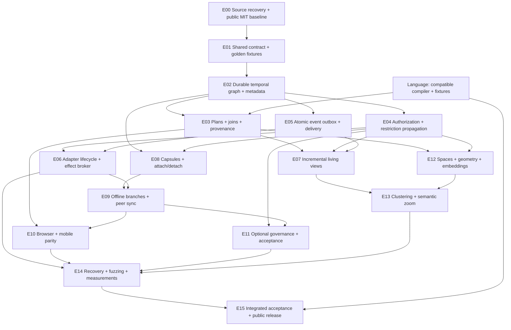
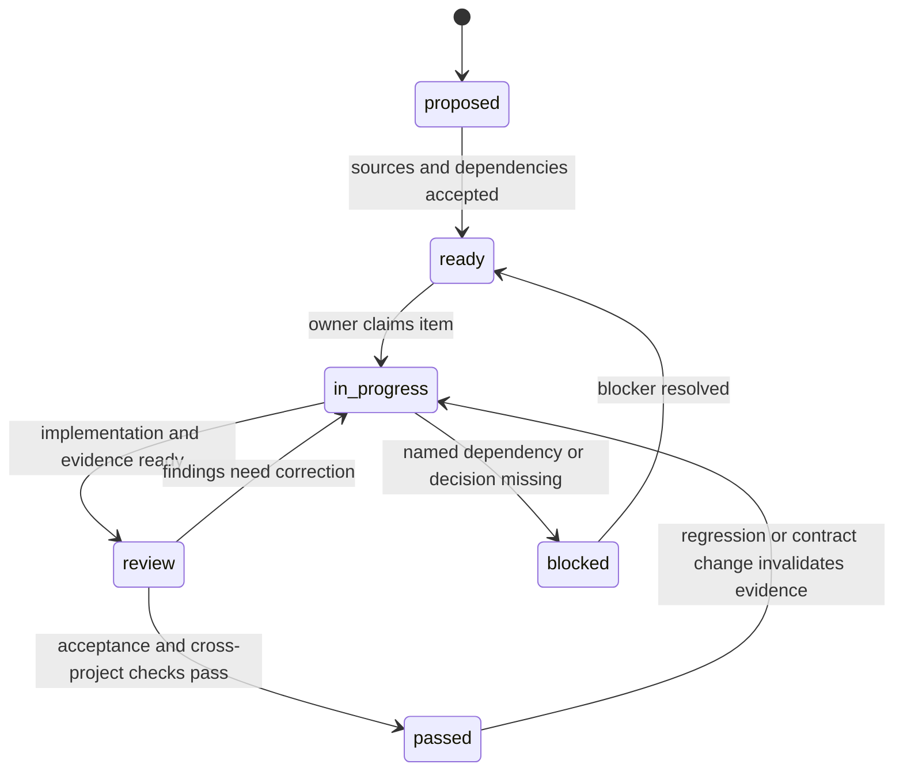

# Engine workflow and dependency graph

The machine-readable source is [workflow.json](workflow.json). Nodes are acceptance gates, not promises that features are already implemented. Parent orchestration owns publication and cross-project acceptance; the engine agent owns this repository. A blocked gate does not mark the entire project complete.

## Work item state machine

Work proceeds from the earliest ready gate. Parallel work is allowed only when dependencies and file ownership are clear. Contract changes need both project owners, regenerated fixtures and compatibility evidence. Add implementation issues under gates; preserve requirement IDs in issue titles/descriptions and test evidence. Security or correctness failures reopen affected downstream gates.

## Orchestrator cadence

At each gate, report completed behavior, evidence, failures, next ready work and cross-project dependencies. Parent orchestration coordinates the language output format before engine query implementation and checks publication live. Full completion requires E15, not E02's useful local demo. Early releases must identify their supported subset and remaining requirements without claiming the white-paper scope is finished.
