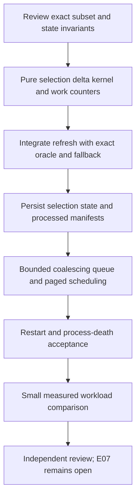

# First exact incremental living-view profile

Status: reviewed implementation profile, based on engine `45e0ea6`. The first kernel/refresh stage is described in [incremental selection](../INCREMENTAL_SELECTION.md); SQLite marker 13 is approved for private auxiliary state. Durable scheduling remains the next distinct checkpoint. No shared protocol change. E07 remains in progress.

The engine paper [section 5](../source/Weave_Engine_White_Paper_v0.1.md) requires snapshot-pinned execution, incremental materializations, batched invalidation and processed-input watermarks; stale indexes must not silently become current truth. It identifies differential dataflow as a research foundation, not a mandated implementation. This first profile implements an exact incremental selection operator while retaining the existing [full recomputation](../VIEWS.md) as oracle and fallback. It does not add differential joins, recursive maintenance or a distributed consistency claim.

## Supported inputs and operators

The fast path accepts a standalone `Query` over one graph/revision or graph/branch, followed by zero or more existing `Filter` expressions. Query predicate, from/to local IDs and fact-time selectors retain their current meanings. Both positive and negative claims remain independent source claims; deletion is membership removal, never an inferred negative assertion. Fixed and explicit Tick clocks are supported.

The stored source must be an ordinary graph outside protected identity/governance namespaces. Both legacy edges and explicit structural-edge/assertion profiles can qualify. Schema descriptors and JSON properties are preserved exactly. Readers on nodes, structures and claims are allowed: visibility uses the view's exact installed principal and current source snapshot. Source eligibility requires no metadata attachments/references, context qualifiers/scopes/carriers, generic influence, node/assertion derivation references or groups, or structural references to other snapshots. A materialized source copied from another query therefore normally does not qualify, because its pinned proof dependencies must remain enforced.

Eligibility is checked on the integrity-verified raw source, not inferred from an already filtered result. A new head that introduces a dependency, changes schema/profile, or otherwise leaves the supported subset switches to full evaluation atomically. Unsupported syntax or source shape does not produce an extra public diagnostic or hide a valid view: ordinary evaluation remains authoritative. Eligibility/work diagnostics stay local trusted-host/test information.

Joins, Union/Diff/Project, Support, rules, explanations, metadata navigation, Context/TypedContext, geometry, accepted identity/governance, clustering and external proof dependencies use full recomputation. This preserves current permission/time/provenance semantics while limiting the proof burden. Their general incremental maintenance remains required future E07 work.

## What is incrementally maintained

A per-view selection state records the exact source pin, source profile/schema fingerprint, evaluator fingerprint, ordered source member fingerprints, visibility/selection bits and endpoint reference counts. A changed record is identified by `(kind, local ID)` plus canonical payload fingerprint and ordinal; explicit assertion and structural namespaces remain distinct. Payload fingerprints only accelerate comparison and do not become graph identities or authority. Order changes are retained even when membership is unchanged.

The maintained predicate is the conjunction of the original Query and Filter conditions, preserving their actual time constants. Two different fixed times must not be silently collapsed into the later one. A filter with no predicate or time is a no-op. If any layer prunes to edge endpoints, isolated nodes stay pruned; otherwise all visible source nodes are retained, matching today's evaluator.

- Initial registration evaluates the full oracle, verifies the eligible source and seeds the selection state.
- A head change loads and verifies the new snapshot, compares ordered source records and computes removals, additions and changed payloads. Removed and changed claims remove their previous membership contribution before replacements are tested.
- A node reader/identity/space change revisits its incident claims; a structural-edge change revisits its explicit assertions. Visibility changes on a claim revisit that claim. Endpoint membership uses counts so deleting one of several incident claims does not retract the shared node prematurely.
- Predicate/from/to/valid interval changes revisit only affected claim candidates. A source-wide schema/profile change falls back and reseeds rather than applying a guessed local rewrite.
- A tick without source change visits indexed interval start/end boundaries crossed since the prior tick, with half-open `[start,end)` semantics. Simultaneous changes are deduplicated before membership evaluation. An interval wholly crossed between coalesced ticks may have zero membership at both endpoints; its unobserved intermediate presence is not fabricated as a delivered event.
- All selections are assembled in source order and rendered through canonical existing materialization/envelope logic. Result schema, polarity, origins, source assertions, coverage and time intervals must equal the oracle exactly.

This is genuinely incremental **membership evaluation**, not delta-only storage access. Current commits replace complete serialized snapshots; reading and digest-validating a changed source remains **O(input)**. Every source revision also changes provenance pins, even for unchanged objects, so exact result rendering/serialization and repinning remain **O(output)**. An unrelated source edit may therefore change every retained node's source pin and the view generation. It is incorrect to compare only entity membership or to call unchanged members byte-identical.

Existing `change_between` semantics are retained: the complete QueryResult, tick and provenance determine whether the generation advances. A tick can advance the generation with no membership delta. A head change that changes only the input snapshot can advance the generation even for an empty value. Delta extraction must not weaken these semantics in pursuit of a smaller change list.

Delta-addressable primary storage, an authoritative per-revision object index/change journal, safe operation-local authorization caching and provenance representation improvements are prerequisites for claiming delta-only I/O or broadly sublinear refresh cost. They are separate proposals. No speedup, asymptotic total-work improvement or constant-time query claim is made here.

## Current authority and exact fallback

Every public read, refresh, transition and worker computation establishes its own SQLite operation snapshot and samples the installed authority clock once. Fact-time ticks do not change authority time. The existing current-result authorization guard remains mandatory for cached output and both sides of a retained transition. It is not replaced by a source/index watermark or a cached eligibility flag.

For eligible proof-free sources, changes to static reader lists arrive in immutable source revisions. All inputs that can depend on an independently changing policy or proof use the existing fallback, including previously eligible inputs after a new dependency is introduced. Permission revocation or expiry with no head movement still denies stale output immediately through current guards; scheduling is not an authorization mechanism. Authorization revalidation may still dominate refresh cost or exhaust the existing read budget. This stage does not relax those checks to manufacture a performance result.

A worker computes into tentative state. If eligibility, index verification or resource checks fail before output publication, it discards the tentative incremental change and runs the full evaluator within the same captured input snapshot and operation budget. A fallback cannot reset the read budget. If the oracle itself exceeds its budget or returns unavailable/error, no new result/index/processed watermark is committed; the task remains retryable or requires explicit resynchronization. If it returns an explicit partial result, preserve that coverage exactly and do not certify a complete/current index.

After a fallback returns a complete eligible result, the state may be reseeded atomically. A corrupt or unsupported persisted index is never used as primary truth. Rebuild from primary records where feasible; otherwise return an explicit error without acknowledging the work. Evaluator/schema fingerprint mismatch after software upgrade similarly forces rebuild.

## Durable scheduling and watermarks

Reuse the reverse graph/branch subscriptions already in `view_dependencies` and the durable graph event outbox. A notification requests work; the worker reads actual committed heads, never trusts the event payload as a replacement snapshot. Pinned Query sources ignore later heads. Dynamic/live metadata subscriptions belong to the fallback evaluator; updates invalidate the dependent view without inventing a host graph mutation.

Proposed private state, with exact names/DDL left for implementation review:

| State | Meaning |
| --- | --- |
| Per-principal scan cursor | Last fully scheduled outbox position, plus an in-event dependency-page cursor for large fan-out |
| One pending row per enrolled view/principal | Coalesced latest requested source observation and explicit fact-time tick, bounded priority/age, retry status |
| Per-view processed manifest | Exact input graph/revision/branch, tick, definition/evaluator/schema fingerprint and committed generation |
| Per-view incremental selection state | Ordered source fingerprints, membership bits, temporal boundaries and endpoint counts for the supported profile |

Scanning and inserting/coalescing pending work commit together. Fan-out is paged: an event is not marked fully scheduled until every eligible dependency page is durably queued. If a queue budget prevents progress, retain the event/page cursor; do not silently skip the remaining views. Graph commits still write their normal durable event and are not made contingent on a view queue having room. A registration racing a scanner seeds from an exact current snapshot, installs subscriptions, and records the corresponding internal watermark atomically, avoiding a lost interval.

`drain_view_work(host, work_budget)` is a proposed explicit native host action, not a background thread or serialized authority grant. The host supplies the current trusted principal; stored view ownership does not mint a HostContext. Registration/enrollment and tick requests require that same owner. Initially one bounded view computation runs in one writer transaction. Multiple workers serialize or retry bounded SQLite busy/CAS conflicts. A later lease-based compute-outside-transaction design needs a separate captured-input/CAS review.

A worker pins the latest heads and target tick from one SQL snapshot, computes incremental or fallback output, then atomically stores result, selection state, generation, current/prior transition authorization guards and processed manifest while acknowledging only the work it consumed. A request arriving after that transaction remains queued. Newer source events may be coalesced; the latest requested state and exact retractions from the last published state must survive restart. This is materialized-state delivery, not a promise to emit every intermediate source transition.

The processed watermark is an exact input manifest, not just a global event offset. Internal event sequences, skipped events, private record counts and work counters are never added to public QueryResult or view deltas. Existing one-transition retention and `E_REPLAY_WINDOW` resynchronization remain unchanged.

`RequireCurrent` checks current heads/tick and current authority. If the processed manifest lags, a caller can use explicit synchronous refresh (incremental or fallback) or receive `E_FRESHNESS`; the first profile adds no unbounded wait. `AllowStale` retains its explicit `current=false` behavior and current authorization checks. Partial/unresolved inputs remain unable to certify freshness. Quarantined-block availability, policy-only changes and live metadata recovery can require explicit refresh; universal automatic invalidation for those paths is not claimed by this initial scheduler.

## Resource boundaries

Use the existing 16 MiB primary snapshot, 32 MiB result and shared 4,096-load/128 MiB operation-read limits. Charge serialized selection state, fingerprints, changed-candidate lists, index pages, old/new transition guards and tentative output before accumulating them. Keep counters checked; unknown/oversized state triggers bounded fallback or a real budget error.

Initial enrollment caps should be conservative and host-configured, with proposed defaults: 256 enrolled views per principal, 64 MiB incremental auxiliary state per view, and 256 MiB total auxiliary state per principal. These are additional cache budgets, not permission to exceed the existing result/read limits. Exhaustion disables/rejects incremental enrollment explicitly while preserving ordinary synchronous view evaluation. One task row per enrolled view bounds duplicate-event growth. Scan fan-out pages and worker batches are bounded; coalescing prevents unbounded pending event lists. Aging must prevent a fixed high-priority stream from indefinitely starving an older enrolled view, subject to available host work budgets.

No retention/garbage-collection policy is silently invented. The existing view snapshot/one-transition retention remains authoritative. Logical serialized quotas are not filesystem or RSS isolation, and in-quota workloads can still fail the shared operation budget. Progress under arbitrarily large fan-out is not guaranteed.

## Acceptance and implementation gates

1. **Exact differential oracle:** deterministic generated traces of source inserts/deletes/corrections, reader switches, node/structure changes, explicit and legacy claims, order changes, fixed filters and ticks. After every published update, compare the complete QueryResult, generation, current flag and `ViewChange` with full recomputation from the same captured heads/tick/principal. Include positive/negative conflicts, isolated nodes, shared endpoints, empty results and provenance-only changes.
2. **True incremental work evidence:** deterministic test counters distinguish source records loaded/hashed, candidates compared, memberships reevaluated, temporal boundaries visited, output objects repinned and fallback runs. One local claim correction must reevaluate its affected membership set; a tick must reevaluate crossed boundaries, not the entire candidate set. Expected O(input) comparison and O(output) repinning are reported separately. Counters are host/test diagnostics, not private-data telemetry exposed to readers.
3. **Fallback parity:** every excluded operator/dependency/context/protected namespace and an eligibility-changing update yields exactly the current oracle result or error. Inject corrupted/missing state, version mismatch and budget exhaustion; no mixed incremental/oracle output, budget reset, partially written generation or falsely current watermark is allowed.
4. **Authority:** re-run current governance/identity revocation and expiry tests against cached reads, queued fallback refreshes, current/prior transitions and lost-response retries. Ensure hidden-only unsupported records do not change public coverage merely through eligibility classification. Cross-principal state lookup and a serialized principal cannot gain authority.
5. **Durability:** real process exit after queue insertion before scan cursor commit; after selection/result writes before processed watermark commit; after commit before response. Restart yields either all-old or all-new state, one generation transition per published update, no source graph mutation and no lost latest request. Coalesced corrections/deletions/ticks and duplicate outbox events remain idempotent. Test two connections racing refresh and a request arriving during bounded work.
6. **Freshness and scheduling:** lagging manifests refuse `RequireCurrent`; allowed stale values remain authorized and explicit. Large fan-out resumes from an in-event page cursor. Queue saturation cannot silently advance scheduling. Pinned sources remain unchanged, while fallback live dependencies invalidate without fabricated host events. Partial values never claim current completeness.
7. **Measured limits:** use small fixed workloads first, report kernel counters and end-to-end wall time/bytes separately. No speed claim unless measured; a slower first implementation is reported candidly. Use one existing target cache and `CARGO_BUILD_JOBS=2`, no duplicate heavy builds, and a bounded test corpus before expanding to larger workloads.

Before coding, review the classification predicate, exact oracle/envelope reuse boundary, worker transaction boundary, quota behavior and migration shape. Initial SQLite marker selection is deferred. This profile advances true incremental selection and durable scheduling, while differential joins/rules, shared-metadata fan-out optimization, policy-driven automatic invalidation, fine-grained storage, richer retention and full living-view conformance remain open.
